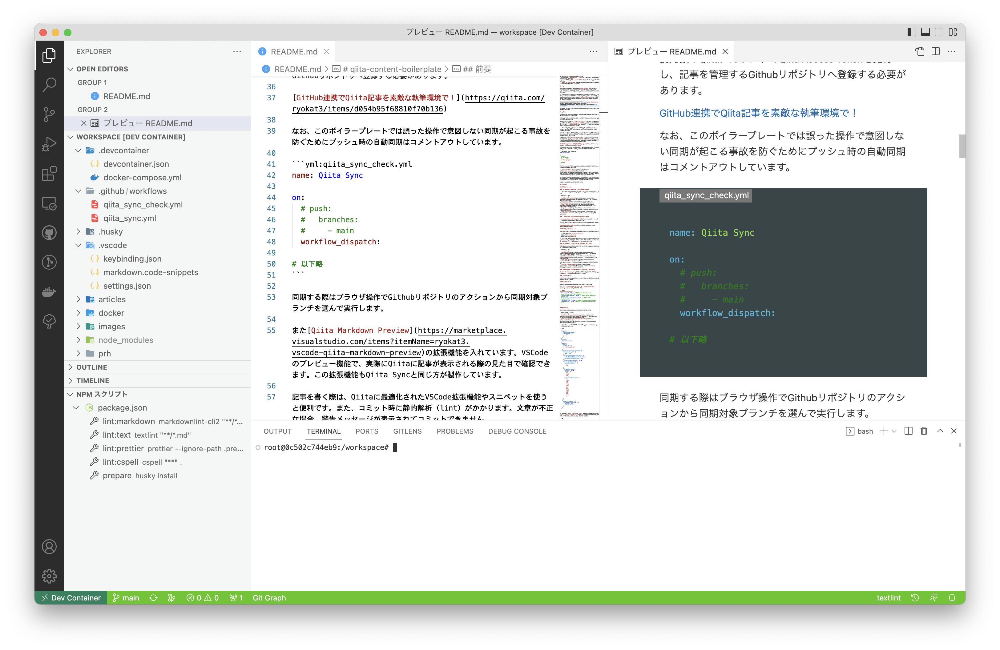
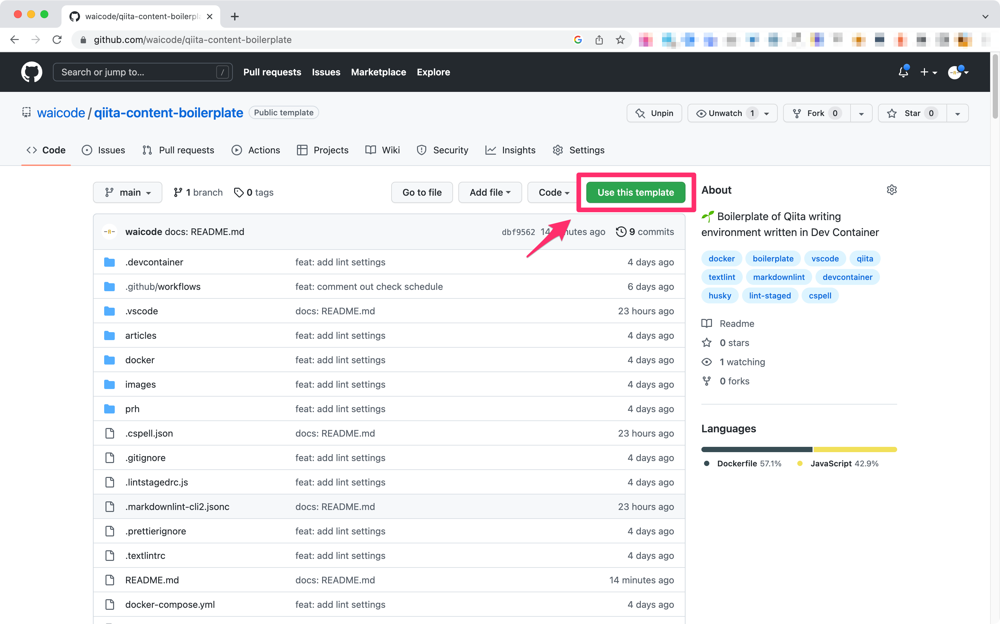

<!--
title:   VSCodeでGitHub連携するQiita執筆環境ボイラープレート
tags:    Qiita,VSCode,devcontainer,Markdown,GitHub
private: false
-->

# QiitaをGithubと連携してVSCodeで書くために

Githubリポジトリと連携してVSCodeで書くことができる**Qiita執筆環境のボイラープレート**[^1]を作成しました。



[**Githubのテンプレートリポジトリ**](https://github.com/waicode/qiita-content-boilerplate)として公開しているので、テンプレートを複製してすぐに記事を書き始めることができます。

[^1]: 中身を自分で埋める必要がある「テンプレート」に対して、変更せずにそのまま使える定型的なソースコードや設定ファイル群を意味します。

# Qiita執筆環境ボイラープレートの特徴

* **Qiitaの執筆に最適化されたVSCode拡張機能やスニペット**が自動的にインストールされます。
* VSCodeの見た目が**Qiitaテーマカラー**になるので、何を編集しているのか分かりやすくなります。
* [**Qiita Sync**](https://github.com/ryokat3/qiita-sync)を使って、**Githubリポジトリで管理しているマークダウン記事をQiitaへ投稿**（同期）します。
* [**Qiita Markdown Preview**](https://marketplace.visualstudio.com/items?itemName=ryokat3.vscode-qiita-markdown-preview)を使って**ローカル環境でプレビューを確認しながら記事を書く**ことができます。
* 記事の内容は `markdownlint`,`textlint` で静的解析（lint）を行います。
* 英単語の誤字がないか `cspell`（Code Spell Checker）でチェックします。
* `husky` と `lint-staged` でコミット時に自動でlintします。そのため、不正な形式の文章はコミットされません。

# 前提：VSCodeとDocker（Dev Container）が必要

記事を編集するエディタは[**VSCode**](https://azure.microsoft.com/ja-jp/products/visual-studio-code/)（Visual Studio Code）を使います。**Qiita執筆に最適化されたVSCodeの拡張機能やスニペット**がインストールされます。

また、Dockerで専用コンテナを準備して執筆環境をつくります。そのため、**ローカル環境にDockerのインストールが必要**です。特にこだわりが無ければ、GUIで簡単にDockerコンテナを導入できる[**Docker Desktop**](https://www.docker.com/products/docker-desktop/)が（個人利用であれば）無料で使えて便利です。

VSCodeからコンテナにアクセスして執筆するため[**Dev ContainersのVSCode拡張機能**](https://marketplace.visualstudio.com/items?itemName=ms-vscode-remote.remote-containers)も必要です。

利用にあたって、**ローカル環境にVSCodeとDockerが準備されていることを前提**としています。VSCodeのdevcontainer環境は、独立した開発環境をつくるには打って付けの構築手法です。構築のための手間と準備は必要なので、ちょっと面倒で難しそうだと思われていた方もいるでしょう。

しかしながら、**ボイラープレートにすべて設定が組み込まれている**ので、VSCodeとDockerがインストールされていれば設定変更不要でそのまま使うことができます。

# ボイラープレートの使い方

## 執筆環境を準備する

[**Githubのテンプレートリポジトリ**](https://github.com/waicode/qiita-content-boilerplate)の右上にある **"Use this template"** をクリックして、ボイラープレートからリポジトリを複製します。



VSCodeで複製したリポジトリをクローンして **"Reopen in Container"** でコンテナを立ち上げます。


Dockerコンテナの構成管理のために、Docker Composeを使っています。コンテナを立ち上げると `./docker-compose.yml` と `docker/Dockerfile` の内容に基づきコンテナ環境を構築します。

その後で `package.json` に記述したライブラリがインストールされます。さらに `devcontainer.json` に書かれた設定によって、VSCode拡張機能がインストールされます。

<details><summary>devcontainerの中で既存のdocker-compose.ymlの設定をオーバーライドしている理由</summary>

実際のコンテナ構成として使われるのはルート直下にある `./docker-compose.yml` の設定ファイルです。`.devcontainer/docker-compose.yml` では、既存の設定ファイルをオーバーライドする記述を入れてます。（具体的には、公式が提供している[こちらの設定ファイル](https://github.com/microsoft/vscode-dev-containers/blob/main/containers/docker-existing-docker-compose/.devcontainer/docker-compose.yml)を参考にしています）このような構成にしておくと、VSCode環境以外でもdocker-composeの設定ファイルを使い回すことができます。

</details>

## 記事を書いて同期する

VSCodeで編集した記事をQiitaへ投稿するために、**Qiita SyncのGithubアクションが設定**されています。

[**Qiita Sync**](https://github.com/ryokat3/qiita-sync)はQiita APIを活用した非公式の連携ツールです。Githubリポジトリにプッシュして同期アクションを実行すれば、連携したアカウントのQiita記事と同期されます。

詳しくはツール製作者の[@ryokat3さん](https://qiita.com/ryokat3)が書いている使い方の記事を確認してください。記事を同期するために、連携対象のQiitaアカウントでQiita Access Tokenを発行し、記事を管理するGithubリポジトリへ登録する必要があります。

https://qiita.com/ryokat3/items/d054b95f68810f70b136

なお、ボイラープレートでは誤った操作で意図しない同期が起こる事故を防ぐため、プッシュ時の自動同期はコメントアウトしています。

```yml:qiita_sync.yml
name: Qiita Sync

on:
  # push:
  #   branches:
  #     - main
  workflow_dispatch:

# 以下略
```

同期する際はブラウザ操作でGithubリポジトリのアクションから同期対象ブランチを選んで実行します。


また、[**Qiita Markdown Preview**](https://marketplace.visualstudio.com/items?itemName=ryokat3.vscode-qiita-markdown-preview)の拡張機能も入れています。VSCodeのプレビュー機能で、**実際にQiitaに記事が表示される際の見た目で確認**できます。この拡張機能もQiita Syncの製作者が提供しています。

# ボイラープレートの設定内容

記事を書く際は、**Qiitaに最適化されたVSCode拡張機能やスニペットを使うと便利**です。また、**コミット時に静的解析（lint）が実行**されます。文章が不正な場合、警告メッセージが表示されてコミットできません。

詳しい設定について、後述していきます。

## 記事を書くための設定

### VSCodeの拡張機能でマークダウンを効率よく書く

マークダウンの文章を書く効率を上げるために、以下の拡張機能が自動的にインストールされます。

| 拡張機能 | 説明 |
| ---- | ---- |
| [Markdown All in One](https://marketplace.visualstudio.com/items?itemName=yzhang.markdown-all-in-one) | ショートカットや便利なコマンド|
| [:emojisense:](https://marketplace.visualstudio.com/items?itemName=bierner.emojisense) | 絵文字入力の補助 |
| [Insert Date String](https://marketplace.visualstudio.com/items?itemName=jsynowiec.vscode-insertdatestring) | 現在時刻をショートカット入力|
| [Copy file name](https://marketplace.visualstudio.com/items?itemName=nemesv.copy-file-name) | ファイル名を右クリックメニューからコピー|
| [Path Intellisense](https://marketplace.visualstudio.com/items?itemName=christian-kohler.path-intellisense) | パスを入力補完 |

それぞれの拡張機能の使い方は以下の記事で詳しく解説しています。よければ参考にしてください。

https://qiita.com/waicode/items/1310d3f0aeb24f393b88

#### 独自のマークダウン記法はVSCodeスニペットで

`.vscode/markdown.code-snippets` にQiita独自の記法を含むマークダウン記法のスニペットを登録しています。

Qiitaで使えるマークダウン記法は、Qiita公式が出している以下の記事に詳しく書かれています。

https://qiita.com/Qiita/items/c686397e4a0f4f11683d

### 記事内容をチェックする設定

このボイラープレートには、以下に対して静的解析（lint）する設定が入っています。

* マークダウンの形式（`markdownlint`）
* 文章の校正（`textlint`）
* 英単語の誤字（`cspell`）

なお、マークダウンファイル以外はコードフォーマット（自動整形）が `prettier` で実施されます。マークダウンファイルは `markdownlint` と設定が競合するため、意図的に対象から外しています。

#### VSCodeエディタ上で問題があればリアルタイムで確認

静的解析（lint）はVSCodeの拡張機能も入るので、問題があればエディタで編集中にリアルタイムで確認できます。

| 拡張機能 | 説明 |
| ---- | ---- |
| [markdownlint](https://marketplace.visualstudio.com/items?itemName=DavidAnson.vscode-markdownlint) | VSCodeのエディタ上でマークダウン構造を解析 |
| [vscode-textlint](https://marketplace.visualstudio.com/items?itemName=taichi.vscode-textlint) | VSCodeのエディタ上でテキストを解析 |
| [Code Spell Checker](https://marketplace.visualstudio.com/items?itemName=streetsidesoftware.code-spell-checker) | VSCodeのエディタ上で英単語の誤字をチェック |
| [Prettier - Code formatter](https://marketplace.visualstudio.com/items?itemName=esbenp.prettier-vscode) | VSCodeでコードフォーマット（自動整形） |

#### コミット時にも確認して不正な形式のマークダウンを警告

`husky` と `lint-staged` でコミット時に自動でlintします。そのため、不正な形式の文章はコミットされません。

コミット時のlintについて詳細が知りたい方は、以下の記事を参考にしてください。

https://qiita.com/waicode/items/33311d0a511dc821f53f

#### lintの詳細設定

ボイラープレートなので、特に設定を変更せずそのまま使えます。使っていきながら、好みの設定に書き換えてください。以下では初期設定内容について説明します。

##### markdownlint

`markdownlint` でマークダウンの構文チェックを行います。デフォルトの構文チェックは厳しめに設定されています。

そのため  `.vscode/settings.json` と `.markdownlint-cli2.jsonc` で一部ルールを調整しています。

```jsonc
"markdownlint.config": {
  "line-length": false, // MD013: Disable the maximum number of characters per sentence
  "no-duplicate-heading": false, // MD024: Allow duplicate heading text
  "no-trailing-punctuation": false, // MD026: Allow headings with . ,;:
  "no-inline-html": false, // MD033: Allow HTML description
  "no-bare-urls": false // MD034: Allow URLs to be written as is
}
```

##### textlint

`textlint` を使えば、テキストを校正できます。ベースとして以下の2つのプリセットを適用しています。

| プリセット名 | 説明 |
| ---- | ---- |
| [textlint-rule-preset-ja-spacing](https://github.com/textlint-ja/textlint-rule-preset-ja-spacing) | 日本語のスペース有無を決定するtextlintルールプリセット |
| [textlint-rule-preset-ja-technical-writing](https://github.com/textlint-ja/textlint-rule-preset-ja-technical-writing) | 技術文書向けのtextlintルールプリセット |

こちらもプリセットのままだと厳し過ぎる箇所があるため `.textlintrc` で設定を一部上書きしています。

```json
{
  "plugins": {
    "@textlint/markdown": {
      "extensions": [
        ".md"
      ]
    }
  },
  "filters": {
    "comments": true
  },
  "rules": {
    "prh": {
      "rulePaths": [
        "./prh/index.yml"
      ]
    },
    "preset-ja-technical-writing": {
      "sentence-length": {
        "max": 150
      },
      "no-exclamation-question-mark": {
        "allowFullWidthExclamation": true,
        "allowFullWidthQuestion": true
      },
      "ja-no-successive-word": false,
      "ja-no-mixed-period": {
        "allowPeriodMarks": [
          ":",
          "："
        ]
      },
      "no-doubled-joshi": {
        "strict": false,
        "allow": [
          "も",
          "や",
          "か"
        ],
        "separatorCharacters": [
          ",",
          "，",
          "、",
          ".",
          "．",
          "。",
          "?",
          "!",
          "？",
          "！",
          "「",
          "」",
          "\"",
          "”",
          "“"
        ]
      }
    },
    "preset-ja-spacing": {
      "ja-space-around-code": {
        "before": true,
        "after": true
      }
    }
  }
}
```

また、校正用辞書を `/prh/rules` へ追加できるようにしています。初期設定では `/prh/rules/tech.yml` に技術用語の校正辞書をいくつか登録しています。必要に応じて用語を追加してください。

```yml
meta:
  - title: 技術用語の固有名詞ルール
rules:
  - expected: インターフェース
    patterns:
      - インターフェイス
      - インタフェース
      - インタフェイス
    prh: 技術用語
  - expected: ソフトウェア
    pattern: ソフトウェアー
    prh: 技術用語
  - expected: ハードウェア
    pattern: ハードウェアー
    prh: 技術用語
  - expected: デフォルト
    pattern: ディフォルト
    prh: 技術用語
```

##### cspell

許可する言葉は `.cspell.json` の `words` に追加します。対象の文字列にカーソルを合わせてVSCodeのクイックフィックスで登録するのが便利です。


##### Prettier

`.prettierignore` に `*.md` 記載して、マークダウンファイルをコードフォーマットの対象外にしています。その他の設定は特に入れていません。自動整形時はデフォルト設定が適用されます。

# 注意点：編集履歴コメント・通知は管理画面で

リポジトリから同期させた場合、編集履歴にコメントを残す・編集通知を送信できません。

これらを行いたい場合、**Qiita管理画面から編集**する必要があります。

Qiita Syncは管理画面で記事を編集した場合でも、あとから同期（sync）アクションでGithubリポジトリに変更内容を取り込むことができます。この点はとても便利です。

# Zenn執筆環境のボイラープレート

同様の仕組みでZenn執筆環境のボイラープレートも公開しています。Zennの記事を書く方はこちらも合わせてご確認ください。

<!-- ZennのURL -->

# Qiitaを技術ブログと同じVSCodeで書けるようにしてみた結果

もともと **「技術ブログと同じ環境で記事が書けたら、効率もモチベーションも上がりそう」** がボイラープレート作成に至ったきかっけでした。

実際につくってみて、作業効率以上に**情報発信面でメリット**を感じることができました。

詳しくは以下の記事にまとめています。よろしければご覧ください。

https://archt.blue/articles/boilerplate
