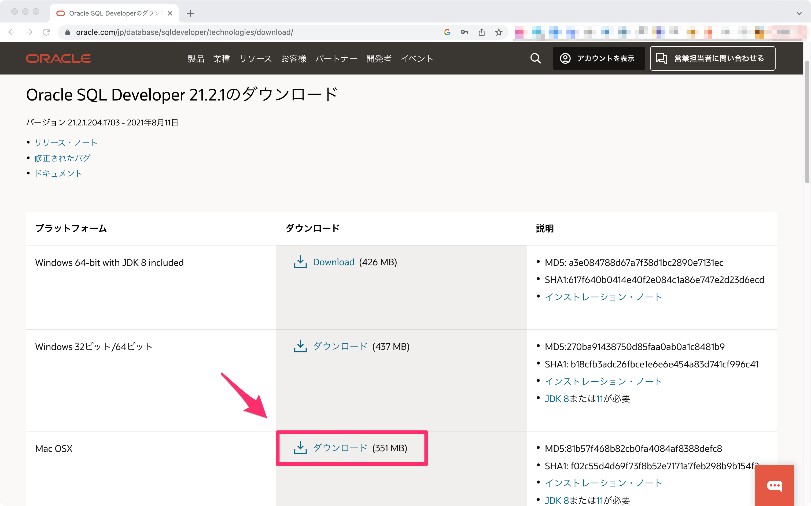
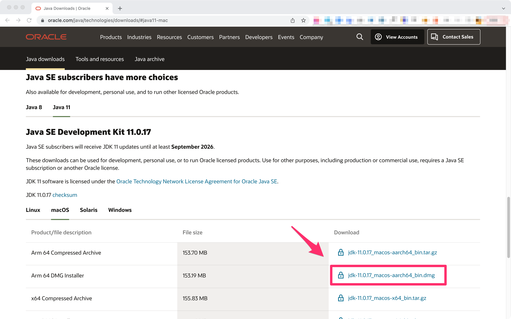
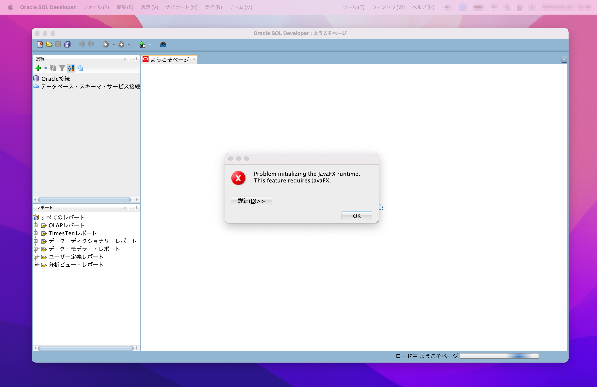
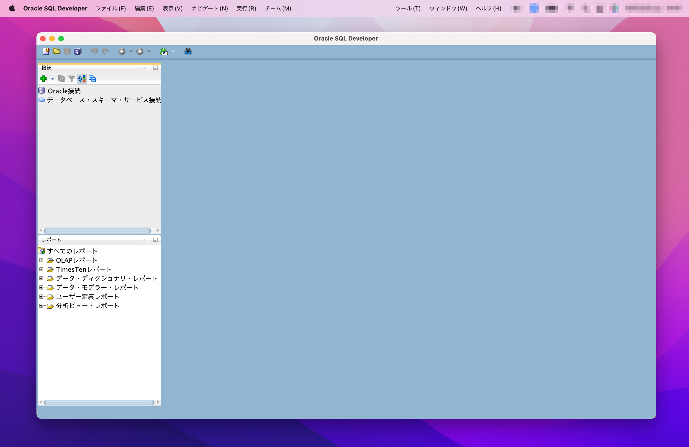

<!--
title: M1,M2(ARM)のMacBookでOracle SQL Developerをエラーゼロで動かす
tags: oracle,sqldeveloper,JDK,M1,M2
private: false
-->

# M1,M2 MacでもSQL Developerは快適に動かせる

Oracle SQL Developerは無料で使える**Oracle専用のDatabaseのIDE**です。

単純なSQLクライアントに比べて、たくさんの機能が搭載されています。そのため、動作はやや重めです。しかしその分、**少ないクリックとキー操作で複雑なデータベース関連タスクを実行**できます。

* 踏み台経由のデータベース接続設定を保存
* クエリを書かずにオブジェクトを作成
* オブジェクト情報とその関連性を視覚的に表示

などなど、少し踏み込んでOracleを扱う上で欠かせないツールになっています。

クラウドネイティブに基準が移りつつある世の中で、新しいアーキテクチャでOracleを採用することは以前と比べると少なくなりました。

ですが、たとえばレガシーなオンプレミス環境をクラウド環境へ移行する場合、最新のM1,M2 MacBookでOracleに向き合わなければならないこともあるでしょう。

# ARM用のJavaが入れば問題なく動く

Oracle SQL Developerには各プラットフォーム（Windows, Mac, Linux）のためのアプリケーションが用意されています。

Javaを使って動作するため端末に別途JDK（Java Development Kit）のインストールが必要になりますが、Javaがあれば特に苦労なく動きます。

最新のMacBook ProやMacBook Airに搭載された**M1,M2チップは「ARM（aarch64）アーキテクチャ」が採用**されています。M1チップが出始めた頃は、ARMアーキテクチャでJava8またはJava11を準備して動作させるのに一手間が必要でした。現在は公式が準備してくれているので、手順がだいぶ楽になりました。

ここから先は、公式の手順にできる限り則ってインストールして動作させる手順を書いていきます。

ただし、JDKインストールだけでは**JavaFxのエラーが発生**します。そのため、エラーゼロで動かすために別途対応が必要です。

:::note info
[Azul](https://www.azul.com/)などJavaFxがバンドルされた非公式JDKをインストールしてエラーを回避する方法もあります。この記事では、すべてOracleのサイトからダウンロードしてインストールする手順で説明しています。
:::

# 動作確認環境について

この記事では以下のバージョンで動作確認しています。執筆時の最新のバージョンです。

## Oracle SQL Developer

<dl>
  <dt>バージョン</dt>
  <dd>21.2.1.204.1703</dd>
  <dt>更新日</dt>
  <dd>2021年8月11日</dd>
</dl>

## Java SE Development Kit

<dl>
  <dt>バージョン</dt>
  <dd>11.0.17</dd>
  <dt>更新日</dt>
  <dd>2022年10月18日</dd>
</dl>

# SQL DeveloperとJDKのインストール

まずはインストール手順を説明していきます。

## Oracle SQL Developerのインストール

まずは**Oracle SQL Developer**をダウンロードしてMacbookでインストールします。

https://www.oracle.com/jp/database/sqldeveloper/technologies/download/

プラットフォームが「Mac OSX」の最新版をダウンロードしてインストールしてください。



ダウンロードのためには**Oracleプロファイルへのサインインが必要**です。プロファイル（アカウント）を持っていない場合は、必要事項を記入してサインアップしてください。

まだ、このタイミングではOracle SQL Developerを起動できません。

SQL Developerを起動すると「Java8またはJava11がインストールされていないので起動できない」というエラーメッセージが表示されます。

## Java11のインストール

以下へアクセスして**Java11（JDK11）をインストール**します。

https://www.oracle.com/java/technologies/downloads/#java11-mac

ここで「Arm 64 DMG Installer」を選んでダウンロードします。



この手順でインストールを行えば、特に設定変更せずともSQL DeveloperがJava11を見つけてくれるので起動が成功します。

インストールされたJDKは以下の場所に格納されています。MacBookにデフォルトで入っているJDKと同じ場所に入ります。

```console
# pwd
/Library/Java/JavaVirtualMachines
# ls -lt
total 0
drwxr-xr-x 3 root wheel 96 10 22 12:48 jdk-11.0.17.jdk
drwxr-xr-x 3 root wheel 96  5  5  2020 jdk-14.0.1.jdk
```

# JavaFXのエラーを解決する

ただし、このままでは起動時に以下のエラーが発生します。

> Problem initializing the JavaFX runtime. This feature requires JavaFX.

SQL Developerが「ようこそページ」を表示するときにJavaFXが必要で、それが見つけられくてエラーになっています。



実用においてそれほど害はありませんが、起動のたびにエラーポップアップを毎回閉じるのは面倒なので対処します。

## ようこそページが表示されないように設定を書き換える

JavaFXを開発で使うわけではないため、エラーがでないように対処するだけでも十分です。**起動時に「ようこそページ」が表示されないよう設定変更**すれば、毎回エラーポップアップを閉じる面倒な手間は無くなります。

手順は[こちらのstackoverflow](https://stackoverflow.com/questions/52484814/oracle-sql-developer-problem-initializing-welcome-page)を参考にしています。

<details><summary>JavaFXをインストールして設定する場合</summary>

JavaFXはJavaでGUIアプリケーションを作成するためのフレームワークです。[OpenJavaFXサイト](https://gluonhq.com/products/javafx/#ea)から「aarch64」のJava11（JDK11）に対応したJavaFXのをインストールして、SQL Developerに読み込ませることでエラーを回避できる可能性があります。ただ、記事作成時点ではAMD（aarch64）対応のJavaFX 11はダウンロードができませんでした。なお、JavaFXがAMD（aarch64）に対応したのも2021年末頃で、比較的最近の出来事です。

</details>

### 設定ファイルの場所を探す

まず、SQL Developerの設定ファイル `dtcache.xml` の場所を探します。インストールしたバージョンによって数値が異なるので `find` コマンドを使います。

```console
# find ~/.sqldeveloper/ -name dtcache.xml
/Users/xxxxx/.sqldeveloper//system21.2.1.204.1703/o.ide.12.2.1.5.42.210420.1713/dtcache.xml
```

### 設定を書き換える

このファイルを開いて `oracle.help.StartPageEditor` のキー項目（`Key`）があるかどうかを確認します。ある場合は、設定値（`Value`）を `false` に変更します。

```xml
<Key>oracle.help.StartPageEditor:TabCheckboxState:Default</Key>
<Value class="java.lang.Boolean">false</Value>
```

このキー項目が見つからない場合は、上記のキー項目と設定値アイテムタグ（`Item`）で囲って、そのまま追加します。

`</dt-cache>` の直前に以下を追加します。

```xml
<dt-cache>
  <!-- 記載を省略 -->
  <Item>
    <Key>oracle.help.StartPageEditor:TabCheckboxState:Default</Key>
    <Value class="java.lang.Boolean">false</Value>
  </Item>
</dt-cache>
```

注意点として、xmlファイルは**SQL Developerが起動されていない状態で書き換え**てください。起動されていると、SQL Developerを停止した際に設定が上書きされて元に戻ってしまいます。

### Oracle SQL Developerが起動することを確認

これでSQL Developerを起動してもようこそページが表示されなくなります。



説明は以上です。

M1,M2 MacBookで快適なSQL Developer生活をお過ごしください。
