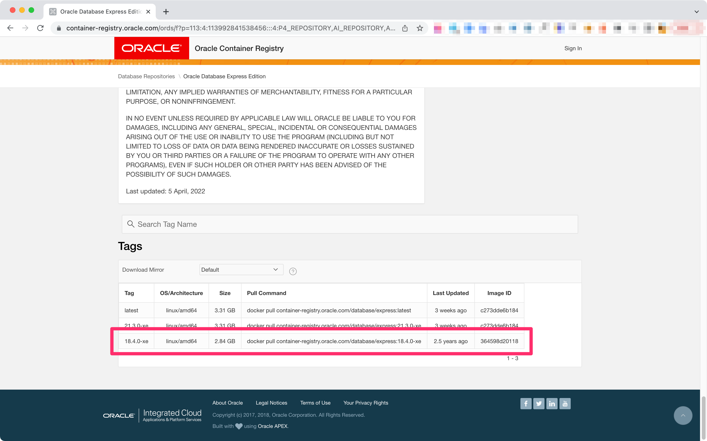
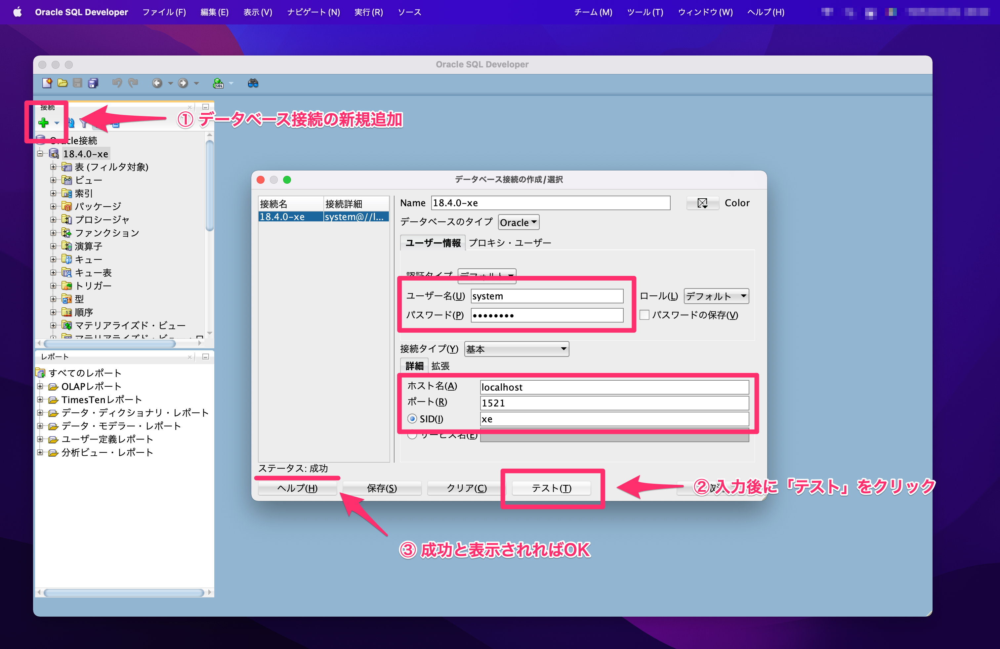

<!--
title:   M1,M2(ARM) MacBookにColimaでOracle Databaseを手間なくインストールする
tags:    Docker,Lima,M1,colima,oracle
id:      d67782c33b7d40052245
private: false
-->


# M1,M2 Macで手間なくOracle開発環境を構築するために

Intel MacからM1,M2 Macに移行してみて、**環境再構築に最も苦戦を強いられたのがOracle Database**でした。

クラウドネイティブに基準が移りつつある世の中で、新しいアーキテクチャでOracleを採用することは以前と比べると少なくなりました。

ですが、たとえばレガシーなオンプレミス環境をクラウド環境へ移行する場合、最新のM1,M2 MacBookを使ってOracleに向き合わなければならないこともあるでしょう。

「せっかく速いMacに変えたのに、Oracle Databaseのために開発端末を2台持ちしないといけないのだろうか…」

この記事では、そんな複雑な事情をお持ちの方に向けて**M1,M2 MacbookにOracle Databaseをなるべく手間なくインストールする方法**をお伝えします。

# M1,M2 MacのDockerにそのままOracleは入らない

大概のアプリケーションはM1,M2 Macに移行してもRosetta[^1]やDockerで動きます。

しかしながら、より低レイヤーに依存しているOracle Databaseはそのまますんなり動いてくれません。

[^1]: Appleシリコン搭載Macでも、Intelプロセッサ搭載Mac用に開発されたアプリケーションを動かせるようにする互換性維持のための技術です。

Dockerでインストールできるなら、その方法が一番はやくて簡単です。しかし上記の事情によりM1,M2 Macでは、そのままではDockerでOracleコンテナを作れません。

そこで、Mac OS上でLinux仮想マシンを立ち上げるLimaを使いIntel Macと同じ環境を再現します。

https://github.com/lima-vm/lima

Limaでつくった仮想マシンの上に、Dockerを入れることでM1,M2 Mac上からDockerを使っているのと同じ体験でコンテナを扱えるようにします。

そして、このLima + Dockerをまとめてやってくれるのが**Colima**です。

https://github.com/abiosoft/colima

もちろん、Colimaを使わずLimaへ個別Dockerインストールも可能です。実際にどちらも試してみましたが、**複雑な設定が不要であればColimaが圧倒的に手間なく環境構築**できました。この記事ではColimaを使った方法を紹介します。

# Colimaをx86_64でセットアップ

## Colimaのインストール

まずは `colima` をMacにインストールします。公式の手順に則り[Homebrew](https://brew.sh/index_ja)でインストールします。Dockerランタイムで動かすためにDockerクライアントが必要です。Dockerが端末に入っていない場合、合わせてインストールします。

```console
brew install colima docker
```

依存ライブラリ含めインストールは時間がかかるので、気長に待ちます。

:::note warn
すでにDocker Desktop（Docker for Mac）をインストールしている場合は、ここでdockerを追加する必要ありません。
:::

`colima version` でバージョンが表示できればインストール完了です。

```console
# colima version
colima version 0.4.6
git commit: 10377f3a20c2b0f7196ad5944264b69f048a3d40
```

設定を分ける必要が無ければ、これで準備は完了です。以下のコマンドを使えばColimaで構築した環境を立ち上げることができます。

```console
colima start
```

ただし、一度起動させるとDiskサイズは後から変更ができません。たくさんデータを扱う場合は、余裕を持ってディスク容量を設定しておくと良いでしょう。

>The default VM created by Colima has 2 CPUs, 2GiB memory and 60GiB storage

デフォルトは2CPU, 2GBのメモリ, 60GBのディスク容量です。

たとえば4CPU, 4GBメモリ, 100GBディスク容量で起動したい場合は以下のコマンドとなります。

```console
colima start --cpu 4 --memory 4 --disk 100
```

## x86_64アーキテクチャを指定する

そして重要な点は `-a x86_64` を指定することです。

デフォルトでは `arch` の設定が `aarch64`（ARM）になっています。これではOracle本体がインストールできないため、**x86アーキテクチャで仮想Linuxを起動**させます。

```console
colima start --cpu 4 --memory 4 --disk 100 -a x86_64
```

colimaを起動すると `~/.colima` フォルダの中に設定ファイルが保存されます。

```console
# pwd
/Users/xxxxx/.colima
# ls -l
total 4
drwxr-xr-x 2 xxxxx staff  64 10 23 11:30 _templates
drwxr-xr-x 3 xxxxx staff  96 10 23 11:31 _wrapper
drwxr-xr-x 5 xxxxx staff 160 10 23 11:34 default
srw------- 1 xxxxx staff   0 10 23 11:32 docker.sock
-rw-r--r-- 1 xxxxx staff 483 10 23 11:32 ssh_config
```

`/Users/xxxxx/.colima/default/colima.yaml` で設定を確認できます。

```yaml ~/.colima/default/colima.yaml
# Number of CPUs to be allocated to the virtual machine.
# Default: 2
cpu: 4

# Size of the disk in GiB to be allocated to the virtual machine.
# NOTE: changing this has no effect after the virtual machine has been created.
# Default: 60
disk: 100

# Size of the memory in GiB to be allocated to the virtual machine.
# Default: 2
memory: 4

# Architecture of the virtual machine (x86_64, aarch64, host).
# Default: host
arch: x86_64

# Container runtime to be used (docker, containerd).
# Default: docker
runtime: docker

# 以下略
```

`colima list` コマンドでARCHが `x86_64` になっていればOKです。

```console
# colima list
PROFILE    STATUS     ARCH      CPUS    MEMORY    DISK      RUNTIME    ADDRESS
default    Running    x86_64    4       4GiB      100GiB    docker
```

# colimaのDockerにOracleコンテナを入れる

DockerにOracleコンテナを入れるには、以下の2つの方法があります。

1. Oracle Container Registryにあるイメージをプルしてコンテナ起動
2. OracleがGitHubに公開しているDockerファイルとLinux用Oracleのrpmファイルでコンテナ起動

どちらのやり方でも実現可能です。今回は前者の**Oracle Container Registryを使って立ち上げる手順**で立ち上げます。

ここでは開発用途で無償利用できるOracle Database Express Edition(XE)の18c（18.4.0-xe）を例に説明します。

## Oracle Container Registry からコンテナを起動

まず、Oracle Container RegistryページからOracleイメージを確認します。

https://container-registry.oracle.com

Express Edition(XE)の使い方が書かれているページはこちらです。

<!-- textlint-disable -->
https://container-registry.oracle.com/ords/f?p=113:4:113992841538456:::4:P4_REPOSITORY,AI_REPOSITORY,AI_REPOSITORY_NAME,P4_REPOSITORY_NAME,P4_EULA_ID,P4_BUSINESS_AREA_ID:803,803,Oracle%20Database%20Express%20Edition,Oracle%20Database%20Express%20Edition,1,0&cs=3gNYbqAcasJ-xDCMV543THn-6hs0fR3Sokc_xXF7VxHBIWuIW-7LpZc61w3B-ePvCKB90WQp18cRTR3VBU2msMg
<!-- textlint-enable -->

ページ最下部のTagsで `18.4.0-xe` が利用できることを確認します。



`container-registry.oracle.com/database/express:18.4.0-xe` のDockerイメージを `pull` します。

```console
# docker pull container-registry.oracle.com/database/express:18.4.0-xe
18.4.0-xe: Pulling from database/express
35defbf6c365: Pull complete
249027472f46: Pull complete
67ae3dfc2d41: Pull complete
Digest: sha256:b17a93fb201562ad142d267c0ac3eecb0e6207debafd6ed51a1da157b9cacab8
Status: Downloaded newer image for container-registry.oracle.com/database/express:18.4.0-xe
container-registry.oracle.com/database/express:18.4.0-xe
```

その後、`run` コマンドでOracleコンテナを立ち上げます。

公式ページ記載内容に則って `docker run` の `-v`（ボリューム）オプションを使い、データを永続化しています。

`-v /Users/xxxxx/docker/oracle/18.4.0-xe:/opt/oracle/oradata` の前半部分 `/Users/xxxxx/docker/oracle/18.4.0-xe` はホスト側でデータを保存したい任意の場所に書き換えてください。Oracle Databaseにデータが書き込まれると、この場所にデータが保存されます。

初期パスワードは分かりやすさのために `Password` を指定しています。（本来はセキュリティのためにもっと複雑な文字列を指定する方がベターです。）

```console
docker run --name 18.4.0-xe \
--memory=2048M \
-p 1521:1521/tcp -p 5500:5500/tcp \
-e ORACLE_PWD=Password \
-e INIT_SGA_SIZE=1028M \
-e INIT_PGA_SIZE=500MB \
-e ORACLE_CHARACTERSET=AL32UTF8 \
-v /Users/xxxxx/docker/oracle/18.4.0-xe:/opt/oracle/oradata \
container-registry.oracle.com/database/express:18.4.0-xe
```

:::note warn
実行コマンドで `-platform=linux/amd64` オプションを指定する必要はありません。colimaを `x86_64` のコンテナとして実行しているためです。
:::

:::note info
テーブル作成、データ登録・更新・参照など簡単な動作検証しかしていません。エラーが発生した場合は `--privileged`（コンテナへ特権モードを付与）オプションを使うことで改善される可能性があります。
:::

コンテナ起動まで長い時間がかかるので、ここも気長に待ちます。

```console
# docker run --name 18.4.0-xe --memory=2048M -p 1521:1521/tcp -p 5500:5500/tcp -e ORACLE_PWD=Password -e INIT_SGA_SIZE=1028M -e INIT_PGA_SIZE=500MB -e ORACLE_CHARACTERSET=AL32UTF8  -v /Users/xxxxx/docker/oracle/18.4.0-xe:/opt/oracle/oradata container-registry.oracle.com/database/express:18.4.0-xe
ORACLE PASSWORD FOR SYS AND SYSTEM: Password
Specify a password to be used for database accounts. Oracle recommends that the password entered should be at least 8 characters in length, contain at least 1 uppercase character, 1 lower case character and 1 digit [0-9]. Note that the same password will be used for SYS, SYSTEM and PDBADMIN accounts:
Confirm the password:
Configuring Oracle Listener.
Listener configuration succeeded.
Configuring Oracle Database XE.
Enter SYS user password:
***********
Enter SYSTEM user password:
*********
Enter PDBADMIN User Password:
*******
Prepare for db operation
7% complete
Copying database files
...
#########################
DATABASE IS READY TO USE!
#########################
…
```

起動が完了したら、Oracle Databaseの初期セットアップは完了です。

`docker ps` でコンテナが起動されたことを確認できます。

```console
# docker ps
CONTAINER ID   IMAGE                                                      COMMAND                  CREATED             STATUS                       PORTS                                                                                  NAMES
c237356a83a2   container-registry.oracle.com/database/express:18.4.0-xe   "/bin/sh -c 'exec $O…"   About an hour ago   Up About an hour (healthy)   0.0.0.0:1521->1521/tcp, :::1521->1521/tcp, 0.0.0.0:5500->5500/tcp, :::5500->5500/tcp   18.4.0-xe
```

## Oracle SQL Developer で接続を確認

作成したOracle Databaseへの接続をOracle SQL Developerで確認します。

M1,M2 MacにSQL Developerをインストールする方法は以下の記事で書いています。よろしければ、参考にしてください。

https://qiita.com/waicode/items/cd64cee96895b8ca7080

新規データベース接続を選択して、以下の項目を入力します。

| 項目名 | 設定値 |
| ---- | ---- |
| ユーザー名 | system（大文字/小文字は不問） |
| パスワード | Password |
| ホスト名 | localhost |
| ポート | 1521 |
| SID | xe |



「テスト」のボタンをクリックして成功のメッセージが表示されれば疎通成功です。

# Colimaはx86_64で動かせるが決して速くはない

M1,M2 Macでも `x86_64` で動かせるcolimaはとても便利ですが、本来はARMアーキテクチャで動かせないものを、仮想化技術で無理矢理動かしています。

そのため動作が決して速くありません。というより、体感でも分かるくらいに「遅い」です。

本格的に開発環境を整えるなら、M1,M2 MacでなくIntel MacやWindowsなどx86アーキテクチャの開発端末をもう1つ用意するのが無難です。

我慢できないレベルで遅いわけではありません。そのため「普段それほど多くはOracle Databaseを使った開発はしないけど、たまに必要になる」程度の開発者であれば、この環境でも十分でしょう。

# ColimaはDocker Desktopとも共存可能

Colimaを使うなら「Docker Desktop（Docker for Mac）と共存できないからアンインストールせよ」という記事をよく見かけます。

実はこれは間違い（というか古い記述）で、ColimaはDocker Desktopと共存できます。

Colimaを起動させるとDockerの向き先（context）がColima側で強制的に奪われてしまいますが、Docker Desktop側を使うようにコンテキストを切り替えれば全く問題なく動作します。

実際、**公式のFAQにもv0.3.0から共存できる**と記載されています。

https://github.com/abiosoft/colima/blob/main/docs/FAQ.md#can-it-run-alongside-docker-for-mac

> Can it run alongside Docker for Mac?
>
> Docker for Macと一緒に動作させることはできますか？
>
> Yes, from version v0.3.0 Colima leverages Docker contexts and can thereby run alongside Docker for Mac.
> Colima makes itself the default Docker context on startup and should work straight away.
>
> Colimaはバージョン0.3.0からDocker contextsを利用しており、Docker for Macと一緒に動作させることができます。
> Colimaは起動時にデフォルトのDockerコンテキストになり、すぐに動作するはずです。

Dockerのコンテキストを確認すると `colima start` したあとは、たしかにcontextの向き先が `colima *` になっていることが分かります。

```console
# docker context ls
NAME                TYPE                DESCRIPTION                               DOCKER ENDPOINT                                      KUBERNETES ENDPOINT   ORCHESTRATOR
colima *            moby                colima                                    unix:///Users/xxxxx/.colima/default/docker.sock
default             moby                Current DOCKER_HOST based configuration   unix:///var/run/docker.sock                                                swarm
desktop-linux       moby                                                          unix:///Users/xxxxx/.docker/run/docker.sock
```

これを `docker context use` を使って `desktop-linux` または `default` に切り替えればDocker Desktop（Docker for Mac）が使えます。

```console
# docker context ls
NAME                TYPE                DESCRIPTION                               DOCKER ENDPOINT                                      KUBERNETES ENDPOINT   ORCHESTRATOR
colima *            moby                colima                                    unix:///Users/xxxxx/.colima/default/docker.sock
default             moby                Current DOCKER_HOST based configuration   unix:///var/run/docker.sock                                                swarm
desktop-linux       moby

# docker ps
CONTAINER ID   IMAGE     COMMAND   CREATED   STATUS    PORTS     NAMES

# docker context use desktop-linux
desktop-linux

# docker ps
CONTAINER ID   IMAGE                           COMMAND                  CREATED       STATUS       PORTS                    NAMES
2a65602a3db7   qiitadocc-qiitadocc             "/bin/sh -c 'echo Co…"   13 days ago   Up 2 hours   0.0.0.0:8009->8000/tcp   qiitadocc

# docker context ls
NAME                TYPE                DESCRIPTION                               DOCKER ENDPOINT                                      KUBERNETES ENDPOINT   ORCHESTRATOR
colima              moby                colima                                    unix:///Users/xxxxx/.colima/default/docker.sock
default             moby                Current DOCKER_HOST based configuration   unix:///var/run/docker.sock                                                swarm
desktop-linux *     moby
```

MacでDockerを扱うのであれば、普段はGUIベースで様々な操作ができるDocker Desktop（Docker for Mac）を使うと最も開発生産性が高いと（個人的には）感じています。

Oracle DatabaseではDocker Desktopが使えないので、（悪い言い方をすると、仕方なく）Colimaを使っています。

Docker Desktopと併用して、**Colimaは「Intel Macでは実現できるがM1,M2 Macでは実現できないこと」にフォーカスして使う**のがオススメです。

説明は以上です。Colimaを使って快適なOracleを。M1,M2 MacでOracleを扱わなければならなくなった大変な人の開発生産性が少しでも上がることを願ってやみません。