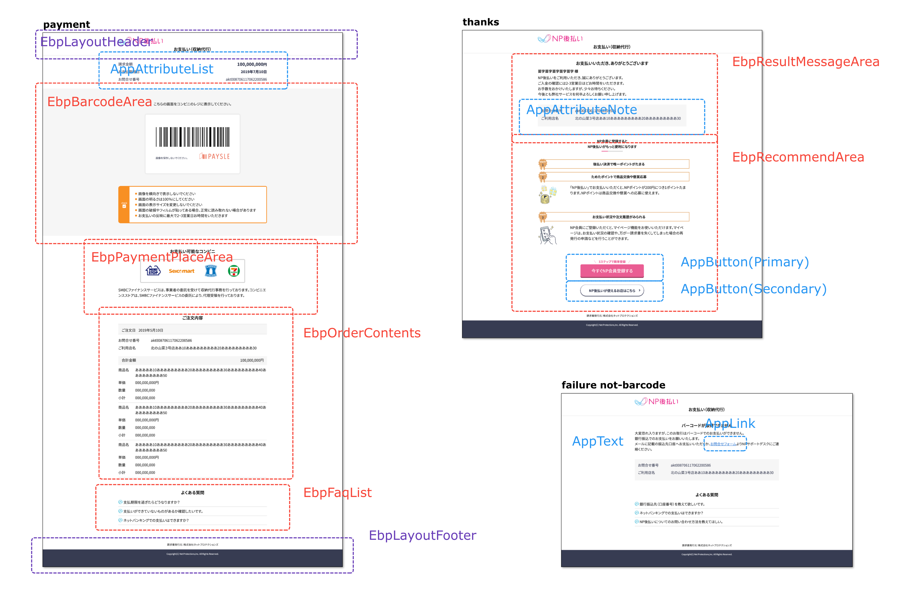
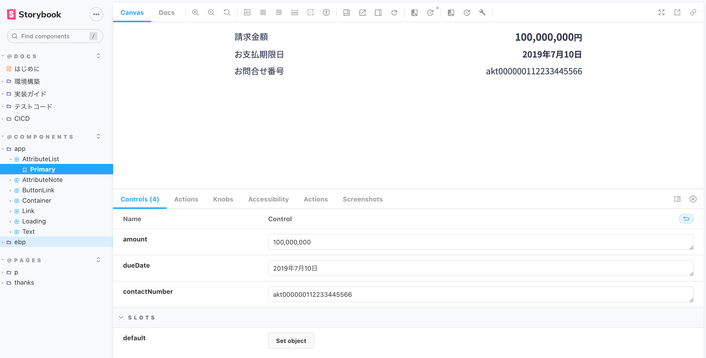
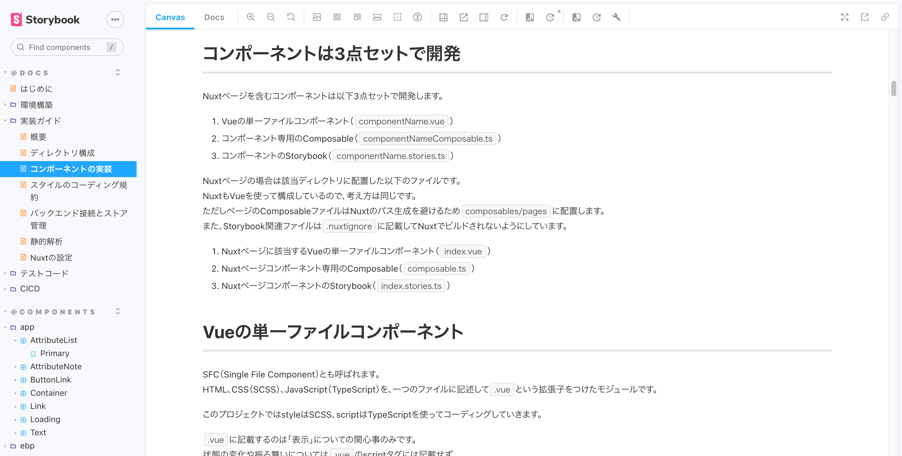

<!--
title:   Storybookとはじめる難しく考え過ぎないコンポーネント駆動開発
tags:    フロントエンド,storybook,Vue.js
private: true
-->

# 小さな画面開発でもコンポーネント駆動の恩恵は受けられる

ReactやVueの普及に伴い、ボトムアップで作った小さなコンポーネントを組み合わせて最終的にページを作る開発手法である「コンポーネント駆動開発」がフロントエンド開発のスタンダードになりつつあります。

このコンポーネント駆動開発は、複雑度がそれなりに高くページ数も多い中・大規模システムで採用される事例をよく見かけます。

* 小さな規模の画面開発でコンポーネント駆動開発を実践するとどうなるのか？
* 実装やテストでどのような恩恵が得られるのか？
* 保守開発を踏まえてコンポーネント駆動開発でやる価値はあるのか？

といった話はあまり聞かないので、弊社のフロントエンド開発事例を記事にしてみました。

実際にやってみた感想を先に書くと、**小さな画面開発でもコンポーネント駆動の恩恵は受けられ**ます。

# Atomic Designは難しい

コンポーネント駆動で開発するために、まず最初に考えるのは「どのようにコンポーネントに分けるか？」についてです。

有名なところではAtomic Design（アトミックデザイン）があります。これらのデザインパターンを導入すると、拡張性や再利用性が高まります。しかしながら、画面数が多い・複雑度の高い開発では恩恵を受けやすくなる一方で、今回の規模では正直やり過ぎ感がありました。

そこで**コンポーネント粒度を決定する基準を極力シンプル**にしました。

## 汎用コンポーネント

他システムへ該当コンポーネントをそのまま移して使っても違和感がなく、大きな調整が不要で再利用できるコンポーネントです。

今回は他システムへの転用は考えていなかったですが、リンクやボタンをコンポーネント化することで、**そのコンポーネントが持つ汎用的な処理をコンポーネントの中に閉じ込められるメリット**があります。

複雑度を下げるため、汎用コンポーネントの中で別の汎用コンポーネントを呼び出す設計は意図的に行いませんでした。

## 画面の役割を持つコンポーネント

たとえば「バーコード表示エリア」や「支払い場所表示エリア」など、その画面が持つ役割を何かしら担っているコンポーネントです。コンポーネントが画面固有のデザインを持っている場合も、汎用コンポーネントでなくこちらに分類しました。

これらのコンポーネントは、単体のコンポーネントで成立する場合もあれば、汎用コンポーネントを含む複数のコンポーネントの組み合わせで実現することもあります。

ここでドメインという言葉を使うのが適切かどうか分かりませんが、イメージとしては、その画面のドメインに関与しているかどうかがコンポーネント決定における唯一の基準です。

複数の画面で使われるコンポーネントであっても、その画面が持つ役割への関与があれば、汎用コンポーネントでなく画面の役割を持つコンポーネントでつくります。

また「なるべく小さく分割する」という考え方ではなく、そのパーツが持つ役割を意識して、再利用性がなければ複数の要素をまとめてコンポーネント化します。

## ページはコンポーネントの組み合わせで構築する

もう１つの基準として、あらゆるページをコンポーネントの組み合わせのみで実現させます。

複雑度が低いちょっとした要素の場合、ついついページ側に直接書きたくなることもあります。しかし、ここは「画面の役割を持つコンポーネント」を用意してページ側から読み込むことを徹底します。この部分を徹底することで、のちのち仕様変更が入った際の影響をコンポーネントに閉じることができます。

上記のシンプルなルールに則り、ページデザインのキャプチャに対してコンポーネント分割をしていきました。

上記の画像はコンポーネント分割したページの抜粋です。（実際にはもう少しページ数があります）

`App` の接頭辞が汎用コンポーネント、`Ebp` の接頭辞が画面の役割を持つコンポーネントです。

もともと作成されていたページデザインは、異常系のパターンが細かく分かれていました。しかしながらコンポーネント化したものを組み込んでみると、異常系のページ自体は１つにして、コンポーネントの組み合わせだけでシンプルに表現できました。

# コンポーネントは3点セットで開発

このシステムはVue/Nuxtを使って実装しました。

コンポーネント開発をするときは、以下の3点セットで開発することを標準ルールにしました。

- 画面描画を担うコンポーネントファイル（`componentName.vue`）
- コンポーネント固有の処理をまとめたファイル（`componentNameComposable.ts`）
- コンポーネントのStorybookファイル（`componentName.stories.ts`）

コンポーネント固有の処理をまとめたファイルを別途設けているのは、描画と処理を分けて見通しを良くする意図もありますが、Vue特有の事情も少し含まれてきます。

`.ts` ファイルとして独立させておいた方が、Storybookとの定義共有やユニットテストのやりやすさが上がるためです。特に `.vue` ファイルに対してテストコードを書く場合、Vue関連テストツールへの依存度が上がってしまうため、TypeScriptファイルを扱うことで選択肢が増えます。

なお、コンポーネント固有でなく汎用的に使われる処理は別の場所にまとめて複数のコンポーネントから呼び出します。また、リアクティブ性を持つ再利用可能なコードとして抽出する必要があるため、Composition APIの利用は必須です。（Reactの場合はHooks）

コンポーネント実装では、画面描画を担うコンポーネントファイルからコンポーネント固有の処理をまとめたファイルを呼び出し、その見た目と動作をコンポーネントのStorybookファイルで確認します。アプリ全体の処理に依存せず、ガシガシとコンポーネントをつくって見た目を確認・認識合わせができるので効率が上がります。

余談ですが、実装ガイド（Wiki）もStorybook上に整備することでフロントエンド開発の関心事をStorybookに集約して管理できます。

# スタイルは画面描画を担うコンポーネントにだけ書く

せっかくコンポーネントを分割したのに、スタイル記述の影響がコンポーネントを跨いでしまうと、影響範囲をコンポーネントに閉じ込めることができません。

スタイルのコーディング規約はBEMを採用し、前述の「画面描画を担うコンポーネントファイル」にだけ記述しました。リセットCSSやミックスインを除き、グローバルにはスタイルを書きません。

共通変数はグローバルに定義して一覧性を上げ、各コンポーネントからそれを参照します。stylelintのプラグインでリテラル値の直接指定を禁止することで、ルールから逸脱しない設定値の指定が可能です。

# 見た目のテストは画面キャプチャで楽をする

Storybookを使ったコンポーネント駆動開発の恩恵は、将来的な保守開発を含めて開発生産性が上がることはもちろんですが、見た目のテストが楽できることも無視できません。

このプロジェクトではPlaywrightを使って、コンポーネントの組み合わせで構成されたページの見た目をビジュアルリグレッションテストしています。

一度、期待値となる画面のスクリーンショットを撮れば、意図しない見た目の変更検知が可能になります。

より厳しく確認したければ、コンポーネント単位でやってもよいですのですが、
状態変化を含むすべてのページのキャプチャを撮れば、実際に利用されるコンポーネントを網羅的にテスト可能です。
これは、ページがすべてのコンポーネントの組み合わせで作られているためです。

なお、見た目でなく「コンポーネント固有の処理」「汎用的に使われる処理」については、すべてユニットテストを書きます。見た目とは独立して `.ts` ファイルが存在していることで、
テスト対象の処理を漏れなく確認しやすくなるというメリットもあります。
