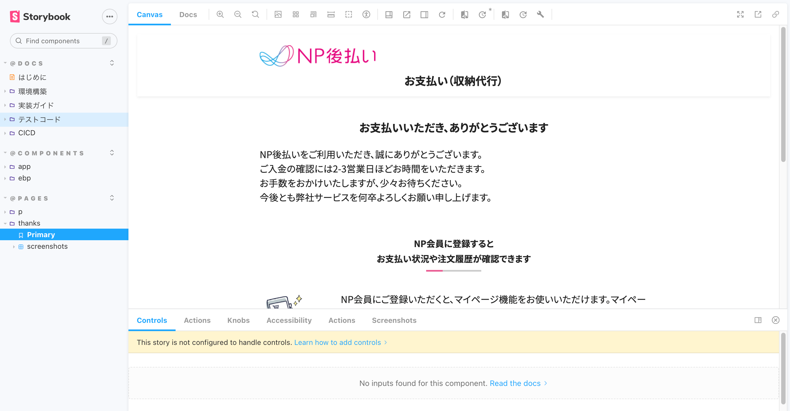
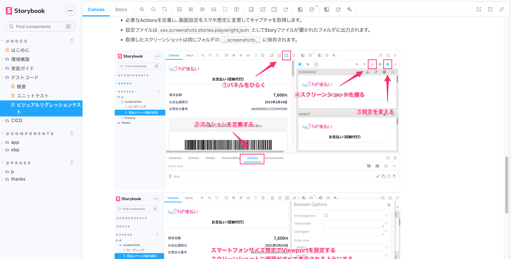

<!--
title:   難しく考え過ぎないコンポーネント駆動開発
tags:    フロントエンド,コンポーネント駆動開発,storybook,Vue.js,Nuxt,
private: true
-->

ReactやVueの普及に伴い、ボトムアップで小さなコンポーネントを組み合わせてページを作る「コンポーネント駆動開発」がスタンダードになりつつあります。

このコンポーネント駆動開発は、複雑度がそれなりに高くページ数も多い中・大規模システムで採用される事例をよく見かけます。

* 小さな規模の画面開発でコンポーネント駆動開発を実践するとどうなるのか？
* 実装やテストでどのような恩恵が得られるのか？
* 保守開発を踏まえてコンポーネント駆動開発でやる価値はあるのか？

といった話はあまり聞かないので、弊社ネットプロテクションズの[NP後払い](https://www.netprotections.com/)事業における支払い画面のフロントエンド開発事例を記事にしてみました。

実際にやってみた感想として、**小さな画面開発でもコンポーネント駆動開発の恩恵は十分に受ける**ことができました。

# Atomic Designは難しい

コンポーネント駆動で開発するために、まず最初に考えるのは「どのようにコンポーネントに分けるか？」についてです。

有名なところではAtomic Design（アトミックデザイン）があります。デザインパターンを導入すると、コンポーネントの拡張性や再利用性が高まります。

しかしながら、画面数が多い・複雑度の高い開発では恩恵を受けやすくなりますが、今回の規模では正直やり過ぎ感がありました。

そこで**コンポーネント粒度を決定する基準を極力シンプル**にしました。

## 汎用コンポーネント

他システムへ該当コンポーネントをそのまま移して使っても違和感がなく、大きな調整が不要で再利用できるコンポーネントです。

今回は他システムへの転用は考えていなかったですが、リンクやボタンをコンポーネント化することで、**そのコンポーネントが持つ汎用的な処理をコンポーネントの中に閉じ込められるメリット**があります。

複雑度を下げるため、汎用コンポーネントの中で別の汎用コンポーネントを呼び出す設計は意図的に行いませんでした。

## 画面の役割を持つコンポーネント

たとえば「注文情報表示エリア」など、その画面が持つ役割を何かしら担っているコンポーネントです。コンポーネントが画面固有のデザインを持っている場合も、汎用コンポーネントでなくこちらに分類しました。

これらのコンポーネントは、単体のコンポーネントで成立する場合もあれば、汎用コンポーネントを含む複数のコンポーネントの組み合わせで実現することもあります。ここでドメインという言葉を使うのが適切かどうか分かりませんが、イメージとしては**その画面のドメインに関与しているかどうかがコンポーネント分類の決定における唯一の基準**です。

複数の画面で使われるコンポーネントであっても、その画面が持つ役割への関与があれば、汎用コンポーネントでなく画面の役割を持つコンポーネントでつくります。

また「なるべく小さく分割する」という考え方ではなく、そのパーツが持つ役割を意識して**再利用性がなければ複数の要素をまとめてコンポーネント化**します。

## ページはコンポーネントの組み合わせで構築する

もう１つの基準として、あらゆるページをコンポーネントの組み合わせのみで実現させます。

複雑度が低いちょっとした要素の場合、ついついページ側に直接書きたくなることもあります。しかし、ここは「画面の役割を持つコンポーネント」を用意してページ側から読み込むことを徹底します。この部分を徹底することで、**のちのち仕様変更が入った際の影響をコンポーネントに閉じる**ことができます。

上記のシンプルなルールに則り、ページデザインのキャプチャに対してコンポーネント分割をしていきました。

上記の画像はコンポーネント分割したページの抜粋です。（実際にはもう少しページ数があります）

`App` の接頭辞が汎用コンポーネント、`Ebp` の接頭辞が画面の役割を持つコンポーネントです。

もともと作成されていたページデザインは、異常系のパターンが細かく分かれていました。しかしながらコンポーネント化したものを組み込んでみると、異常系のページ自体は１つにして、コンポーネントの組み合わせだけでシンプルに表現できました。

# コンポーネントは3点セットでStorybookを使って開発

このシステムはVue/Nuxtを使って実装しました。

また、アプリ全体から切り離して独立してコンポーネント開発をするためにStorybookを使います。

https://storybook.js.org/

コンポーネント開発をするときは、以下の3点セットで開発することを標準ルールにしました。

1. 画面描画を担うコンポーネントファイル（`componentName.vue`）
2. コンポーネント固有の処理をまとめたファイル（`componentNameComposable.ts`）
3. コンポーネントのStorybookファイル（`componentName.stories.ts`）

コンポーネント固有の処理をまとめたファイルを別途設けているのは、描画と処理を分けて見通しを良くする意図もありますが、Vue特有の事情も少し含まれてきます。

`.ts` ファイルとして独立させておいた方が、Storybookとの定義共有やユニットテストのやりやすくなるためです。特に `.vue` ファイルに対してテストコードを書く場合、Vue関連テストツールへの依存度が上がってしまうため、TypeScriptファイルを扱うことで選択肢が増えます。

なお、コンポーネント固有でなく汎用的に使われる処理は別の場所にまとめて複数のコンポーネントから呼び出します。また、リアクティブ性を扱うことができる再利用可能なコードとして分割する必要があるため、Composition APIの利用は必須です。（Reactの場合はHooks）

コンポーネント実装では、画面描画を担うコンポーネントファイルからコンポーネント固有の処理（または汎用的に使われる処理）を呼び出します。その見た目と動作を、コンポーネントのStorybookファイルで確認します。

アプリ全体の処理に依存せず、複数人でガシガシとコンポーネントをつくって見た目を確認・認識合わせができるので効率が上がります。

ページコンポーネントについても、コンポーネントを組み合わせて同様にStorybookで確認します。

余談ですが、実装ガイドをStorybook上に整備することでフロントエンド開発の関心事をStorybookに集約して管理できます。

# スタイルは画面描画を担うコンポーネントにだけ書く

せっかくコンポーネントを分割したのに、スタイル記述の影響がコンポーネントを跨いでしまうと影響範囲をコンポーネントに閉じ込めることができません。

スタイルのコーディング規約はBEM（Blocks-Elements-Modifiers）を採用し、前述の「画面描画を担うコンポーネントファイル」にのみ記述しました。リセットCSSやミックスインを除き、**原則グローバルにスタイルは書かないルール**としました。

SCSSの共通変数はグローバルに定義することで、一覧性を上げることができます。それらを、各コンポーネントから参照します。

つまり、スタイルが具体的に記述されるファイルは以下の2つに集約されます。

* 前述した画面描画を担うコンポーネントファイル（`componentName.vue`）
* 共通変数の定義ファイル（`_variables.scss`）

少し細かい話ですが、stylelintのプラグイン（[stylelint-declaration-strict-value](https://github.com/AndyOGo/stylelint-declaration-strict-value)）で直接リテラル値を設定することを禁止し、変数指定を強制することで、ルールから逸脱しない設定値の指定が可能です。

# 見た目のテストは画面キャプチャで楽をする

Storybookを使ったコンポーネント駆動開発の恩恵は、将来的な保守開発を含めて開発生産性が上がることはもちろんですが**見た目のテストが楽できること**も無視できません。

このプロジェクトではPlaywrightを使って、**コンポーネントの組み合わせで構成されたページの見た目をビジュアルリグレッションテスト**しています。

ビジュアルリグレッションテストとは、期待値となる画面のスクリーンショットを保存しておいて、テスト実行時にスクリーンショットとの差分をチェックするテストのことです。

一度、**画面のキャプチャを撮影しておけば、意図しない見た目の変更検知が可能**になります。見た目のテストはスクリーンショットに任せてテストコードを書く必要がなくなるので、かなり楽できます。

なお、MacやWindowsなどOSが異なると撮影したスクリーンショットの結果に微妙な差異が出てしまう可能性があります。そのため、Docker（VSCodeのdevcontainer）で共通の開発環境を構築しています。

環境構築や画面キャプチャの撮り方を含め、ビジュアルリグレッションテストのための具体手順もStorybookにまとめています。

より厳しく確認したければ、コンポーネント単位でやってもよいですのですが、このプロジェクトではビジュアルリグレッションテストで扱う範囲をページに限定しました。状態変化を含むすべてのページのキャプチャを撮れば、実際に利用されるコンポーネントを網羅的にテスト可能です。これは、ページがすべてのコンポーネントの組み合わせで作られているためです。

なお、見た目でなく「コンポーネント固有の処理」「汎用的に使われる処理」については、すべてユニットテスト（テストコード）を書きます。見た目とは独立して `.ts` ファイルが存在していることで、テスト対象の処理を漏れなく確認しやすくなるというメリットもあります。また、当然ですが実際に打鍵して確認も行います。

# 小さな画面開発でもコンポーネント駆動の恩恵は受けられる

今回、小さな規模の画面開発でコンポーネント駆動開発をはじめて採用してみましたが、実装の効率化や品質面で大きなメリットがありました。

対象となるシステムの規模や特性に合わせてルールを設けてコンポーネント分割をすれば、小さな画面開発でも導入する価値は十分にあると感じています。

このシステムは初回リリース後に何回か仕様変更していますが、**コンポーネント化とStorybookのおかげで保守・追加開発の対応工数をだいぶ抑える**ことができています。

もしもこの記事でコンポーネント駆動開発に興味をもった方がいらっしゃれば、試してみていただければ幸いです。