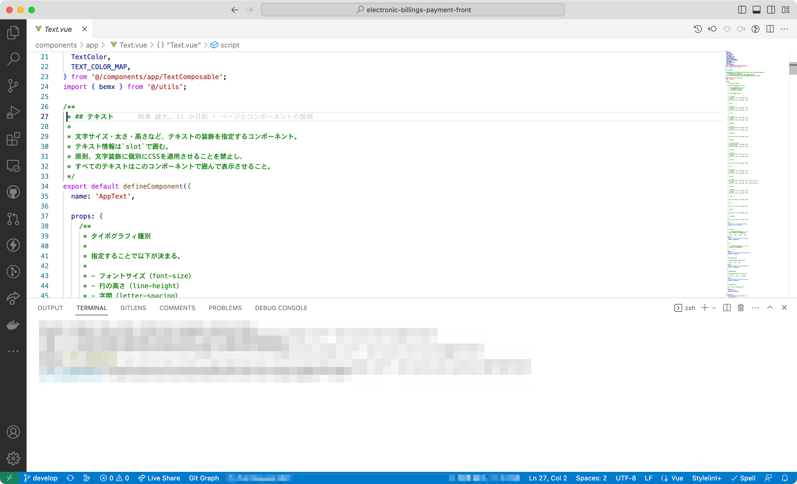
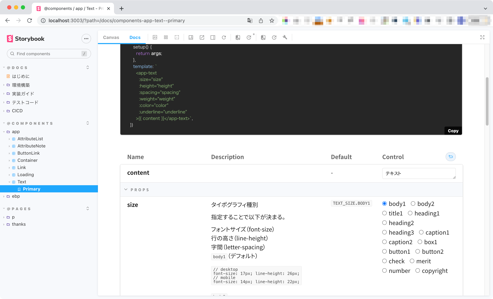

<!--
title:   テキストをコンポーネント化してタイポグラフィの秩序を守る
tags:    Vue.js,storybook,フロントエンド,コンポーネント,テキスト
private: false
-->

前回の記事では、ボトムアップで小さなコンポーネントを組み合わせてページを作る「コンポーネント駆動開発」は小さな画面開発でも十分に恩恵が得られる事例を紹介しました。

https://qiita.com/waicode/items/0b144039bf4b4eddcfee

今回は、その記事の中で紹介した「汎用コンポーネント」の具体的な事例となる**テキストコンポーネント**について紹介します。

# テキストコンポーネントとは

その名のとおり、文字サイズ・太さ・高さなど、**テキストの見た目に関連するあらゆる情報を持つコンポーネント**です。

以下はVue[^1]でのテキストコンポーネントの実装例（抜粋）です。

[^1]: Vue2/Nuxt2での実装例です。 `@nuxtjs/composition-api` の `defineComponent` を使っています。

```vue:AppText.vue
<template>
  <span :class="groupClasses">
    <slot></slot>
  </span>
</template>

<script lang="ts">
import { computed, defineComponent, PropType } from '@nuxtjs/composition-api';

...

export default defineComponent({
  name: 'AppText',

  props: {
    /**
     * タイポグラフィ種別
     *
     * 指定することで以下が決まる。
     *
     * - フォントサイズ（font-size）
     * - 行の高さ（line-height）
     * - 字間（letter-spacing）
     *
     */
    size: {
      type: String as PropType<TextSize>,
      default: TEXT_SIZE.BODY1,
    },

    /**
     * 行の高さ
     *
     * 原則テキストのサイズで決まるため、
     * 特別に上書きする場合のみ指定。
     *
     */
    height: {
      type: String as PropType<LineHeight>,
      default: undefined,
    },
    ...
  },
  setup(props) {
    ...
  },
});
</script>

<style lang="scss">
.AppText {
  &--size {
    &-body1 {
      font-size: $font-size-17px;
      font-style: normal;
      line-height: $line-height-26px;
    }
  }
  &--height {
    &-22 {
      line-height: $line-height-22px !important;
    }
    ...
  }
  ...
}
</style>
```

こんな風に文字を囲って使います。（ソースコードは抜粋）

`app-text` が該当のコンポーネントです。何も指定しない場合はデフォルト値が適用されます。

```html:RecommendArea.vue
<p class="EbpRecommendArea__TextBox1">
  <app-text>NP会員にご登録いただくと、マイページ機能をお使いいただけます。マイページは、お支払い状況の確認や、万が一請求書を失くしてしまった場合の再発行の申請などを行うことができます。</app-text>
</p>
```

```vue:OrderContents.vue
<div class="EbpOrderContents__DataBlock">
  <dl class="EbpOrderContents__DataBlockFlexBox">
    <dt><app-text :size="TEXT_SIZE.BOX1">お問合せ番号</app-text></dt>
    <dd>
      <app-text :size="TEXT_SIZE.BOX1">{{ contactNumber }}</app-text>
    </dd>
    <dt><app-text :size="TEXT_SIZE.BOX1">ご利用店名</app-text></dt>
    <dd>
      <app-text :size="TEXT_SIZE.BOX1">{{ shopName }}</app-text>
    </dd>
  </dl>
</div>
```

```vue:FaqList.vue
<h2>
  <app-text :size="TEXT_SIZE.HEADING1" :weight="TEXT_WEIGHT.WEIGHT700">{{ title }}</app-text>
</h2>
```

テキストの汎用コンポーネントをつくるということは、逆に言えば、他のコンポーネントやページがテキスト固有の情報を持つことはありません。

つまり、あらゆる文字情報がテキストコンポーネントで囲まれ、**コンポーネントやページにテキストのためのCSSが入る余地は一切なくなり**ます。原則、文字装飾を個別にスタイル適用するのは禁止です。

このプロジェクトでは、文字のサイズ（`size`）を指定すると、文字のフォントサイズ・行の高さ・字間まで決まるようにしました。

そのうえで、コンポーネントのプロパティで個別に上書きできるようにしておきます。

```vue:ButtonLink.vue
<app-text
  :size="TEXT_SIZE.BUTTON2"
  :color="TEXT_COLOR.BLACK_NAVY"
  :weight="TEXT_WEIGHT.WEIGHT700"
  >{{ text }}</app-text>
```

# やりすぎでは？CSSで良いのでは？

最初はそう思っていました。

実際にやってみると、テキストコンポーネントをつくること自体の実装コストがそれほど重くありません。そのため、この方法に慣れると規模を問わずコンポーネント駆動で開発するなら汎用コンポーネント化したくなります。

では、慣れていない人に向けての可読性についてはどうでしょうか。

たしかに、各コンポーネントやページでテキストに適用されるスタイルの記述を直接見ることができなくなります。ですが、タグに適用されているサイズを見て判断するのは、それほど難しいことではありません。

むしろ、**個々のテキストのためのCSSが消えることで、それ以外のスタイル記述全体の視認性が上がるメリット**の方が大きいように感じます。

# テキストをコンポーネント化することで得られる効果

大きく2つあります。

この記事では**テキストに込められたデザインの意図**を「タイポグラフィ」と表現しています。

## 1. タイポグラフィが閉じ込められて維持しやすくなる

これは保守運用を想定した、分かりやすいメリットです。

コンポーネント化されたテキストを通じてスタイルが実装されるため、一度仕組みをつくれば、**ルールから逸脱したタイポグラフィが意図せず途中からデザインに入ってしまうことを防ぎやすく**なります。

## ２. 最初の実装時にルールから逸脱したタイポグラフィに気付ける

そしてもう１つ。実感値としては、こちらのメリットが大きいです。

コンポーネント化することで全体像が把握でき**実装をしていく中でルールから逸脱しているタイポグラフィに気付くこと**ができます。

一例として、部分的に別ページから切り出してデザインの中に組み込んだ表示エリアで、タイポグラフィのルールが適用されていないことを検知できました。

スタイル記述を1箇所にまとめるだけでも、同様の効果は期待できます。しかし、そのスタイルが何のためにどのように適用されているのかを厳密に判断するのが難しくなってきます。

その点、コンポーネント化するとすべての文字情報が意図を持って設計されたテキストコンポーネントタグで囲まれるので、例外が入る余地はなくなります。

# Storybookでコンポーネントの意図をドキュメント化する

実装したコンポーネントを意図通り使ってもらうため、ドキュメント化は大切です。

`@storybook/addon-docs` を使えば、ソースコードに書いたコメントをStorybook上にドキュメントとして反映できます。





プロパティの選択肢候補を見た目と一緒に確認できます。

# タイポグラフィのルールはコンポーネント化がおすすめ

テキストのコンポーネント化すると、意図しないスタイルが適用されたテキストに気付くことができ、保守性も上がります。

デザインにタイポグラフィのルールが厳密に定義されているときは特に有効な手段となるので、ぜひ試してみてください。
